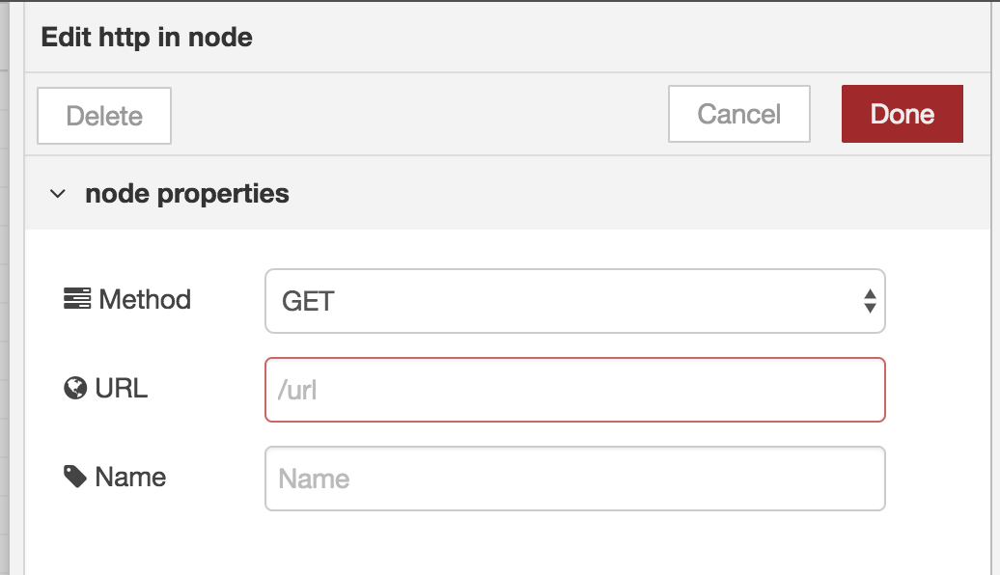
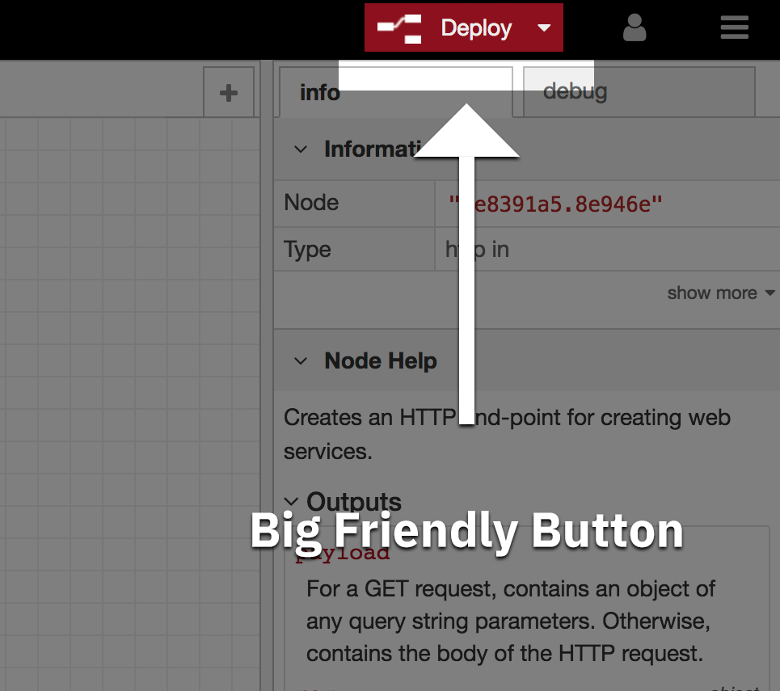
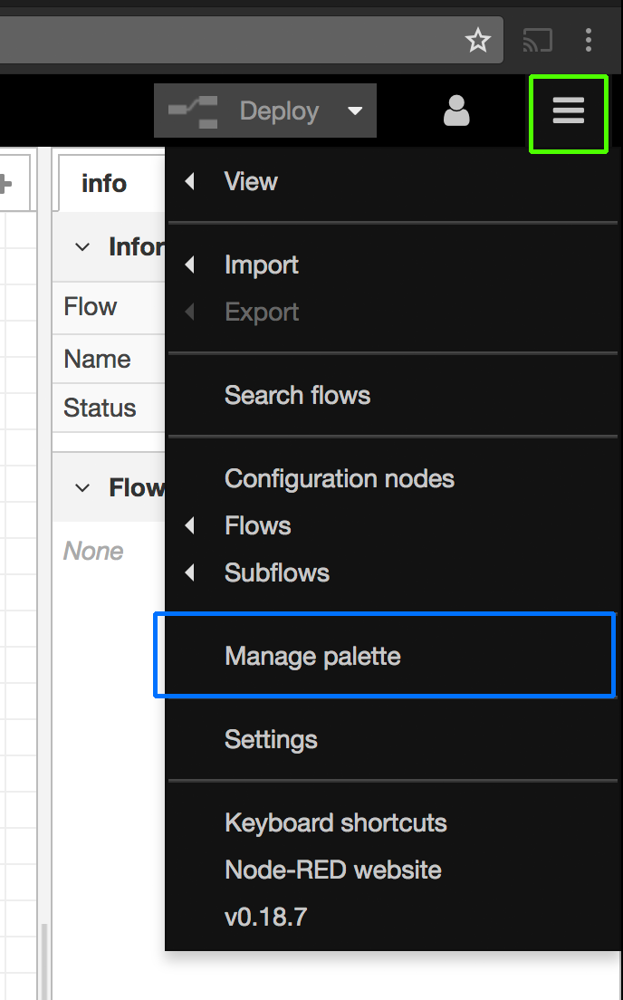
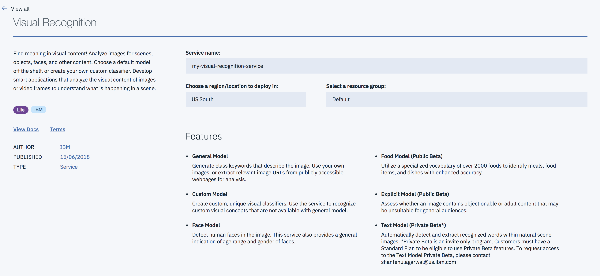
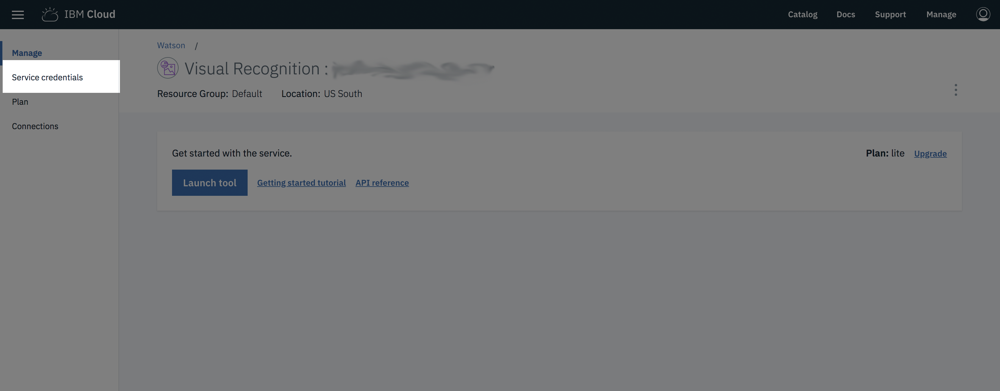
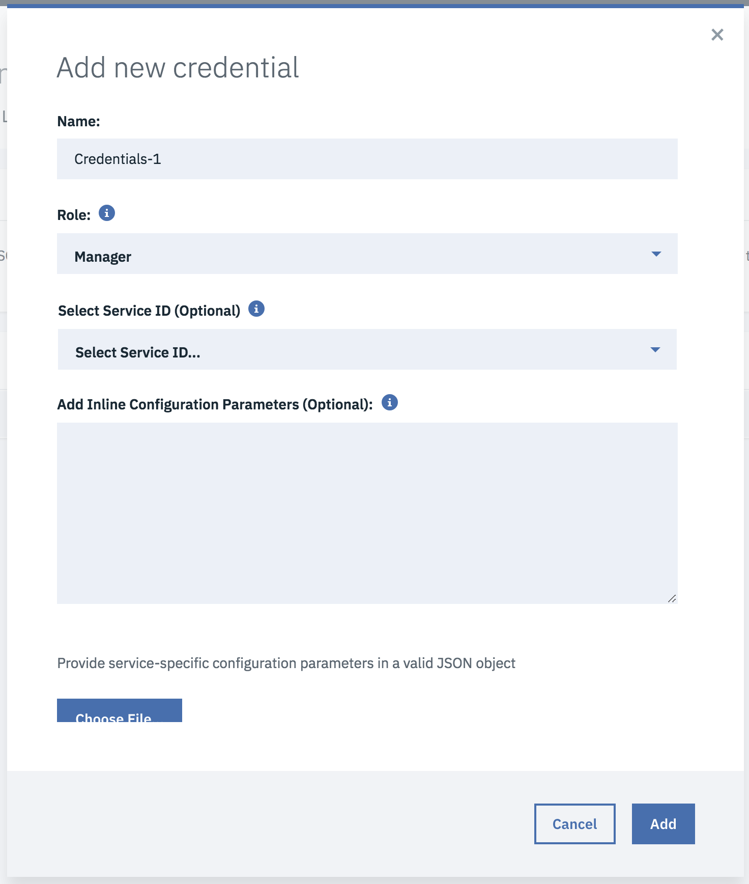
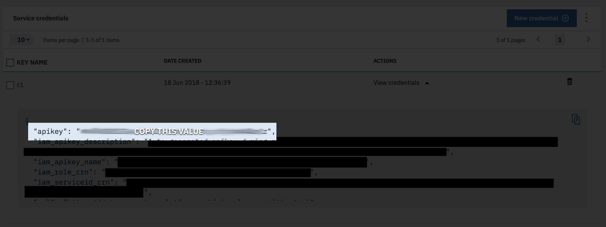
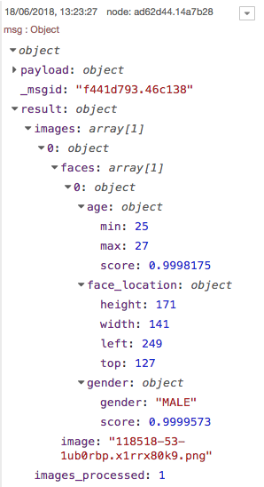
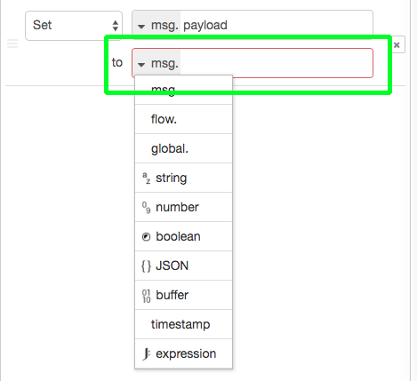
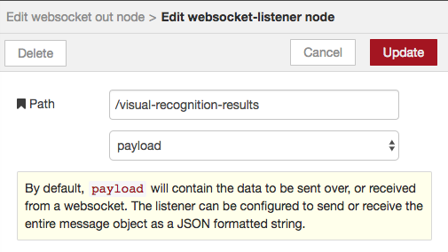

# Node-RED and Watson APIs 101

## Overview

By following this workshop, you will learn:

1. The basic application of flow-based programming (with Node-RED)
2. How to create a simple web server and pass messages between client and server
3. How to use artificial intelligence APIs (IBM Watson Services) with your applications and data.

## Prerequistes

To follow this workshop, you will need:

1. [Node-RED](https://nodered.org/docs/getting-started/installation) installed on your system (or a Node-RED instance hosted on IBM Cloud)
2. An IBM Cloud account. _[Sign up here](https://ibm.biz/BdZUdm)_

If you do not wish to create an IBM Cloud account, you will be able to follow the first half of this tutorial by running Node-RED locally on your system, but you won't be able to complete the AI API section of the tutorial.

## Getting Started

### Creating a Node-RED instance in IBM Cloud
_**NB:** If you have Node-RED installed locally, or already running on a server/in IBM Cloud, you can skip the following steps_

1. Log in to your IBM Cloud Account
2. Go to the [IBM Cloud Catalog](https://console.bluemix.net/catalog/)
3. Search for `Node-RED starter` and click the option to start creating a Node-RED instance
4. In the `App name:` field, enter a uniue name for your Node-RED instance. Remember, the name will be used in part to form the URL that you'll use to access your Node-RED instance, make sure to take note of it _or_ make it easily memorable
5. Once you've entered your unique name, click "Create" in the bottom right of the screen.
6. The Node-RED starter instance will now be created and spun up. Once the process is complete the status of the application will change from "Starting" to "Running". When this happens, click the "Visit App URL" link to go to your Node RED dashboard.
7. You'll now be run through a quick 4 step initial setup process. 
    1. When prompted, do create a username and password for your Node-RED instance, this server will be publically accessible on the internet, and we don't want strangers digging around our lovingly crafted flows.
    2. Once you've entered a username and password, just click next until the process completes and you're taken to your Node-RED instance.
8. Click the "Go to your Node-RED flow editor" button to be taken to where we'll start creating our programs.

## Workshop

### Creating a server with the HTTP Node

At it's core, Node-RED is an interface that's running on an HTTP enabled server, this means we can create HTTP endpoints - and Web applications with very little effort 🎉

1. In the nodes panel on the left-hand side of the Node-RED UI, search for the `http` node with one output and drag it onto the canvas.
2. Back in the node panel, search for the `template` node and drag it onto the canvas - then connect the http node's output to the template nodes input.
3. Search for one final node, the `http response` node, which is similar to _ but distinct from_ the http node we created in step 1. This node will only have one input. Drag it onto the canvas and then connect the `template` output node to the `http response`'s input node.
4. You should now have a flow that looks like the following:


Double click the first `http` node to open up the nodes configuration panel. It looks like this:



5. Click in the `URL` field and type in `/foo`. Then click "Done"
6. We've now configured everything we need to display and empty HTML page on the `/foo` route of our Node-RED instance. All we have to do to make our changes take effect is deploy them, and we can do that by hitting the big red friendly "Deploy" button in the top-right of our UI.



7. Once you've done that, we've now created a brand new endpoint to host our web app on 🎊 The page we've just created will exist relative to the URL of your Node-RED instance... 
    - So, if you're running Node-RED locally, the adress of your Node-RED instance ought to be `http://localhost:1880`, which means that the `/foo` route we created can be accessed at `http://localhost:1880/foo`. 
    - If you're running your Node-RED instance on the IBM Cloud, then you'll be able to access the endpoint by removing everything after `mybluemix.net/` in your URL, and replacing it with `/foo` like `https://my-node-red-instance.mybluemix.net/foo`

8. If you visit your URL, you'll be presented with an empty page - **don't panic!** - that's what we're expecting to see!. Head back to your Node-RED UI and then double click on the `template` node to open the configuration panel.

9. Select and delete the `This is the payload: {{payload}} !` text from the config panel and replace it with `<h1>Hello, world!</h1>`. Then click 'Done', and 'Deploy', and then reload the previously blank page. You should now see Hello, World! in big letters.

### Installing and managing Nodes with the Palette

Node-RED has an entire ecosystem of open-source, 3rd party nodes that developers can use to enhance the functionality of their Node-RED instance. If there's a service you want to access, or a filetype you want to work with then there's probably a node for that!

In the next part of this workshop, we're going to install some nodes that make it possible for us to access the webcam and microphone in our web app and send the picture to a new Node-RED endpoint for storage.

1. Head to your Node-RED dashboard and click the hamburger menu at the top-right of the interface (highlighted in green in the below image) and then click the "Manage Palette" button (highlighted in blue in the below image).



2. This will open the node palette. Here, we can install, update, disable, and delete the nodes in our Node-RED instance. On this occassion, we're going to install some new nodes to use with our application. Click on the "install" tab of the configuration panel and then search for `web-components`. 

3. A list will be populated with the available components that we can install. Work through the list until you find the nodes named `node-red-contrib-web-components` and then click "install" in the bottom right of the list item. 
    - If a prompt appears warning that you may need to restart Node-RED, pay it no mind, just click "Install", everything should be fine.

4. We've now installed some new nodes in our Node-RED instance 🎉 In this case, we've installed some nodes that make it easier to use a webcam in our web apps with our Node-RED instance. First up, we need to update the HTML page that we created in the first part of this tutorial with some extra bits and bobs. Double-click on the `template` node and copy/paste the following code into the text field.

```HTML
<!DOCTYPE html>
<html>
    <head>
        <title>Node-RED AI Photobooth</title>
        <script src="https://rawgit.com/webcomponents/webcomponentsjs/master/bundles/webcomponents-sd-ce.js"></script>
        <script src="/web-components/camera"></script>
        <meta name="viewport" content="initial-scale=1.0, user-scalable=yes" />
    </head>
    <body>
        
        <node-red-camera data-nr-name="photobooth-camera" data-nr-type="still"></node-red-camera>
        
        <!--Snippet 1-->

    </body>
</html>
```

5. Click 'Done' and then 'Deploy'. If you reload the `/foo` web page, you'll see we now have a box telling us that we can "Click to use camera". Do so, and then when prompted click "Accept" to allow your web app to use the camera. We can now take pictures - Smile!

6. So, now we can take pictures with our web app in Node-RED, but we haven't set up a place for those pictures to go. Right now, the pixels capture by your webcam are just flying of into cybernetic oblivion. That's not a fun fate for anything, so let's put that data to use. Go back to your Node-RED flow editor and search for a new node called `component-camera` and drag it onto your flow.

7. Double-click the `component-camera` node you just dragged onto the canvas and enter `photobooth-camera` as the value for the "Connection ID" text field, and then click 'Done'. If you look at the HTML that we copied into our `template` node, you'll see that the `<node-red-camera>` node has an attribute `data-nr-name` and it's value is `photobooth-camera`. This value is used to link the `<node-red-camera>` node in our web app the the `component-camera` node in our Node-RED backend. Now, whenever we take a picture in our web app, it will be send to the `component-camera` node with the same name in our Node-RED flow. Once there, we can do a bunch of things with it!

8. Search for and drag a `debug` node onto the canvas and connect it to your `component-camera` node and then click "Deploy". Before heading back to the `/foo` route, at the top right of your Node-RED dashboard, click the 'debug' tab. This will allow us to see when the `debug` node has receieved an image from the `component-camera` node that we created. 

9. Head back to the web app at `/foo` and reload the page. Take a photo!

10. Go back to your Node-RED dashboard and look at the debug tab. You should see something like `[ 137, 80, 78, 71, 13, 10, 26, 10, 0, 0 … ]` logged out. This means that your Node-RED instance successfully received an image from your web app! Now we're ready to do some clever things 

### Sprinkling our Web Apps with a little AI magic✨

At this point, we've 

1. Created an HTTP endpoint on which we can serve a web app
2. Which can use Web Components to access a web cam
3. And can post pictures taken in our web app back to the Node-RED dashboard where they can be handled.

And that's pretty cool. But, you know what's cooler? ~~a billion dollars~~ Using AI to make sense of what our webcam is seeing! 

Now, using AI sounds like a pretty hefty undertaking, and once upon a time it was, but fear not! Thanks to RESTful APIs like IBM Watson, we can use particular bits of articial intelligence without ever having to even _think_ about managing data sources or neural networks.

So, let's add a little bit of image recognition AI to our photo booth web app.

4. Head back to your Node-RED flow and search for the `Visual Recognition` node.
    - If you're running Node-RED locally / anywhere that isn't IBM Cloud, follow these next instructions to install it, otherwise continue to point 2.
    
        A. Click the hamburger menu icon (3 horizontal lines in the top right of the Node-RED UI) and then click "Manage Palette"
        
        B. Click the 'Install' tab at the top of the configuration panel that opens up and then search for `node-red-node-watson`. Click the "install" button, and then continue with the following steps.

5. Click the grey wire between  your `component camera` node and `debug` node. It will turn orange, then hit your backspace key. This will delete the line.

6. Next, Drag the `visual recognition` node onto the canvas and connect the output of the `component camera` node to the `visual recognition` input node, then connect the output of the `visual recognition` node to the `debug` node. Your flow should now look like the following:


7. Double-click the `visual recognition` node to open the configuration panel. You may notice that we need an API key, but we don't have one yet, so let's create one now!

8. Log in to your IBM Cloud account and head to the [dashboard](https://console.bluemix.net/).

9. Click the 'Create Resource' button in the top-right corner of the screen. A new page will load. Search for "Visual Recognition" and then click to create the resource.


10. Enter details for your new visual recognition service and then click the "Create" button in the bottom right corner



11. After a few seconds, you'll be taken to the dashboard of your newly created visual recognition instance. Here, we can create credentials to allow our Node-RED app to talk to the Watson APIs. On the left hand side of the dashboard, there is a "Service Credentials" button. Click it. 



12. Once the "Service Credentials" page has loaded click the "New Credential +" button and then click the "Add" button in the dialog that next appears.



13. After a few seconds, a new visual recognition credential will have been created for us to use in our app. Click the "view credential" button and then copy the `apikey` value in the dropdown that appears.



14. Head back to your Node-RED dashboard and paste the API key into the API Key field. Then click on the "Detect" dropdown and select "Detect Faces". We've now connected up our webcam to the Watson Visual Recognition service that we created!.

15. Before heading back to our web app, double-click on the `debug` node and change the "Output" selection to "complete msg object", then click "Done" and "Deploy".

15. Head back to your web app at `/foo` and reload the page. Take a selfie of yourself and then head back to the Node-RED dashboard. In your debug panel (on the right hand side of the dashboard) there should be a new object waiting for you (if there isn't give it a moment, we're probably just waiting on the result from Visual Recognition). Click to expand it and look at the `result` property. In here, we'll find the results of Watson analysis of our face:



16. Now, that's pretty cool, but we want to send that information back to our web app, not have to click around in the dashboard. Fortunately, this is easy with WebSockets (which are built-in Node-RED). First up, we'll add some JavaScript into our web app for handling the connection and results, then we'll add some nodes to our flow to hook our Node-RED instance up to the web page. 

17. Copy the following JavaScript and then double-click on the `template` node and paste the code just beneath the `<!--Snippet 1-->` line, then click "Done"

```HTML
<div id="results"></div>

<script>
    
    const WS = new WebSocket(`wss://${window.location.host}/visual-recognition-results`);
    
    WS.onopen = function(e){
        console.log('WS OPEN:', e);
    };

    WS.onmessage = function(e){
        console.log('WS MESSAGE:', e);

        if(e.data){
            const D = JSON.parse(e.data);

            console.log(D);
            
            document.querySelector('#results').innerHTML = `<strong>Minimum estimated age</strong>: ${D.age.min} <strong>Maximum estimated age</strong>: ${D.age.max} <strong>Gender prediction</strong>: ${D.gender.gender} ${D.gender.score * 100}%`;

        }

    };

    WS.onclose = function(e){
        console.log('WS CLOSE:', e);
    };

    WS.onerror = function(e){
        console.log('WS ERROR:', e);
    };
    
</script>
```

18. Our web app now has the ability to connect to our Node-RED instance and get the results of our Visual Recognition request and then display them, but Node-RED hasn't yet been set up to pass that information to our app. We'll do that now. In the nodes panel on the left-hand side of the Node-RED dashboard search for a `change` node and drag in onto the canvas. Connect the output of the `visual recognition` node to the input of the `change` node.

19. Double-click the `change` node and then click the dropdown (highlighted in green in the next image) and select `msg.` Then copy and paste the following into the adjacent text field `result.images[0].faces[0]` and then click "Done".




20. Search for one final node in the nodes panel to the left `websocket`. You should get two results, we want to use the node with the globe on the right-hand side of the node. Drag it onto the canvas and connect the output of the `change` node to the input of the `websocket` node. Your flow should now look like the following:


21. Double-click on the `websocket` node and click the pen icon next to the "Path" input options (highlighted in blue).
 

22. In the next UI enter the value `/visual-recognition-results` in the "Path" input field and then click "Add". The click "Done" and "Deploy" and head back to your web app.

23. Reload the web page and then take another picture of your face. After a few seconds, some text describing what Watson thinks your Age/Gender will appear on the screen. Our app has AI! 
